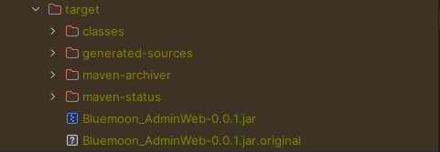
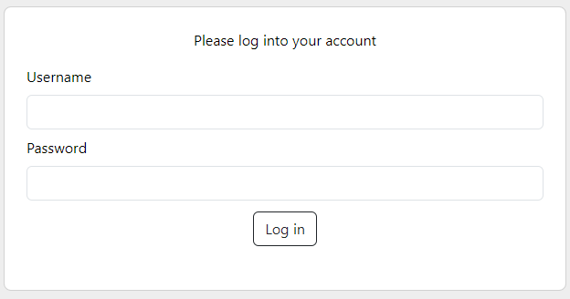
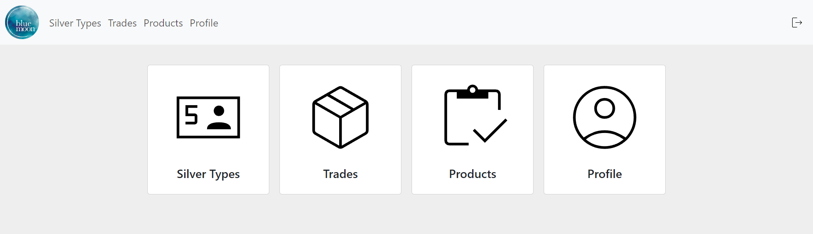
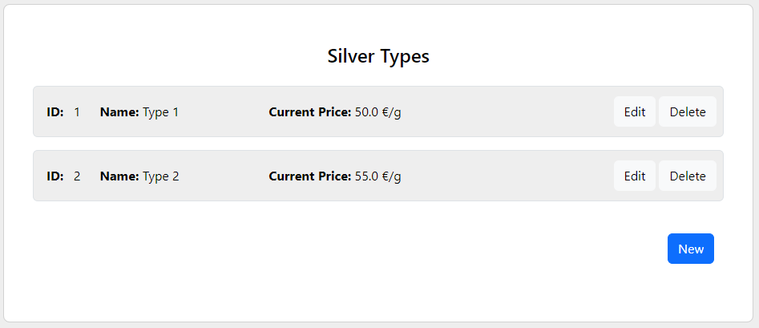
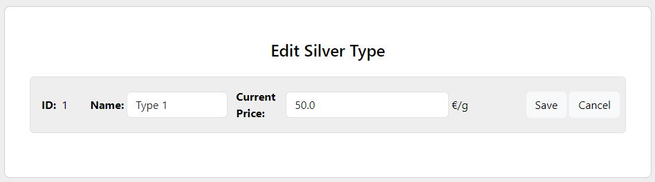
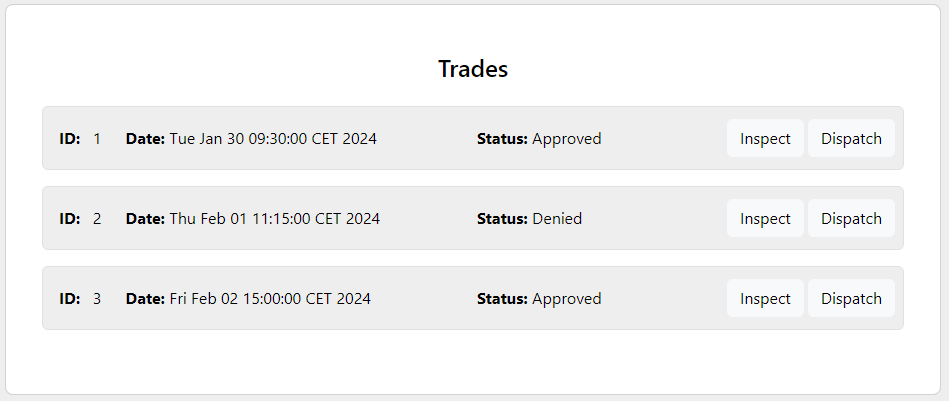
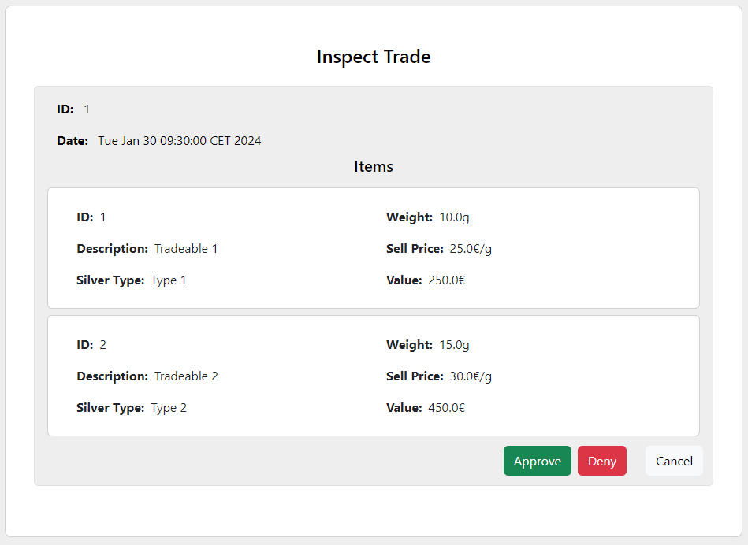
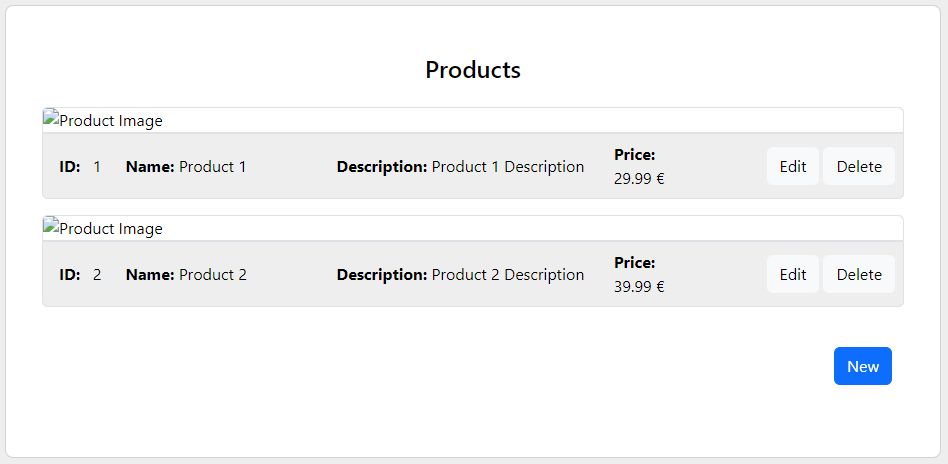
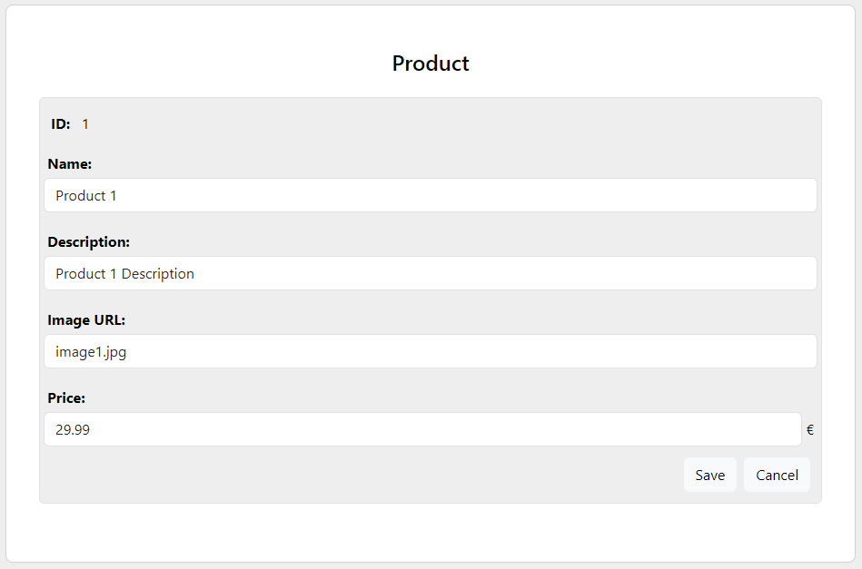

# 
# BLUE MOON ADMIN WEB

---

## BUILDING THE APPLICATION

---

### MAVEN

The project can be built using **Maven**. Use the following command to build the application:

```bash
mvn clean install
```
It will create this folder structure, with the **compiled application** within.
<p align="center">
    
</p>

### DOCKER

The application can be containerized using Docker. Use the provided Dockerfile to build the **Docker image** with the following command:
```bash
docker build -t bluemoonadminweb .
```
After building the docker image you can **create a container** with the following command:
```bash
docker run -p 8081:8081 bluemoonadminweb
```
You can also specify **enviroment variables** to set the **API URL** or the administrator account used internally by the app.
```bash
docker run -p 8081:8081 -e API_URL=url APP_USER_USERNAME=usr APP_USER_PASSWORD=secret bluemoonadminweb
```
By default, the connection data are the follwing: \
**Username**: bluemoon_admin \
**Password**: ur%]SEmRPcvMqfB;2xs>!

## USER MANUAL

---

### LOGGING IN

The application provides a secure login system for authorized administrators to access the management functionalities.

<p align="center">
    
</p>

After successfully loggin in you will be redirected to the dashboard, where you will be able to access all sections of the application.

<p align="center">
    
</p>

### SILVER TYPES

Manage and view information related to different types of silver.

<p align="center">
    
</p>

Edit form:

<p align="center">
    
</p>

### TRADES

Track and manage trades within the system.

<p align="center">
    
</p>

Inspect form:

<p align="center">
    
</p>

When you inspect a form you can either **approve** or **deny** it. Afterwards you will be able to **dispatch** it, which will hide it from the application.

### PRODUCTS

View and manage various products stored in the database.

<p align="center">
    
</p>

Edit form:

<p align="center">
    
</p>